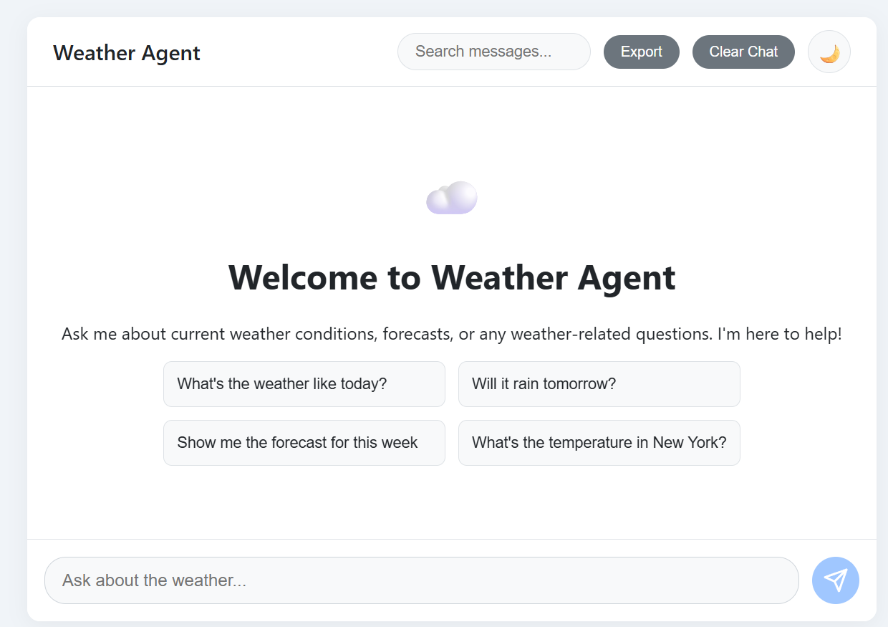
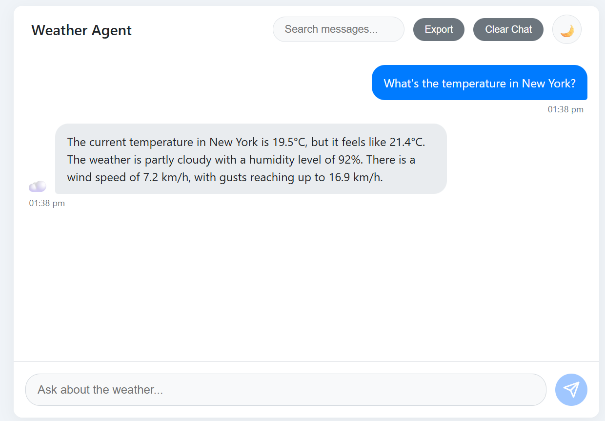
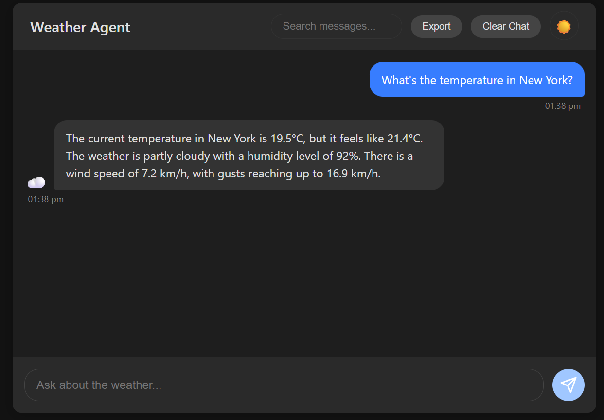
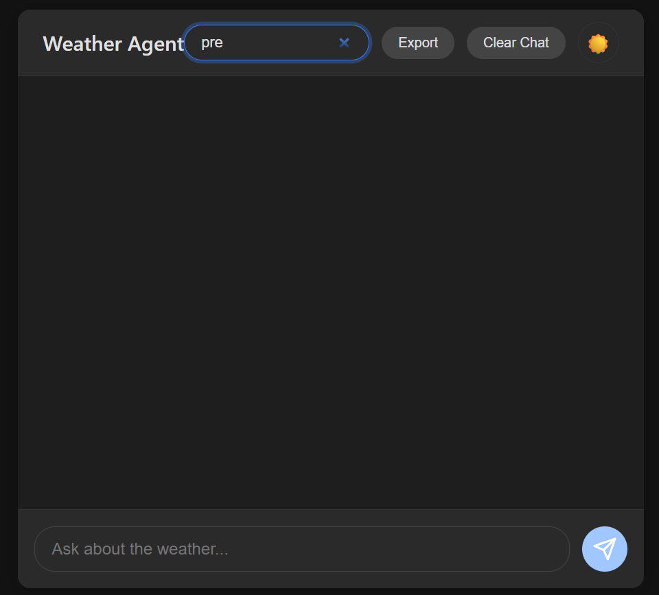
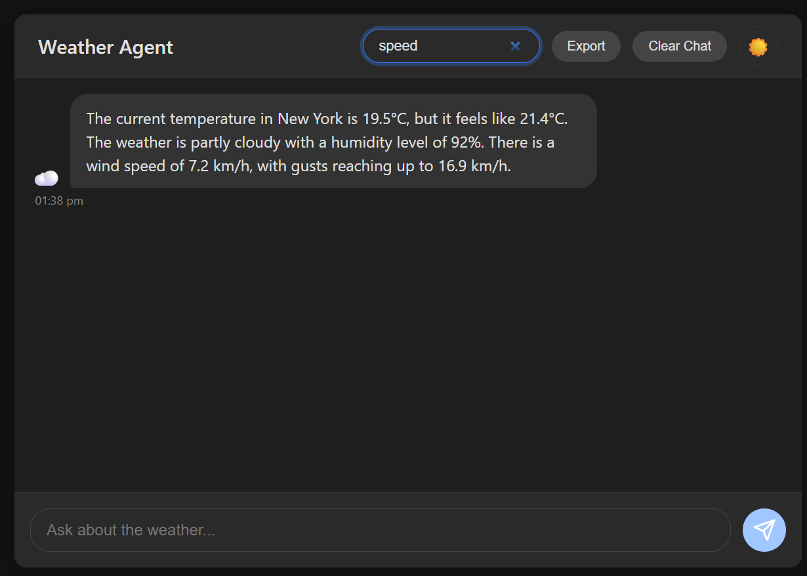
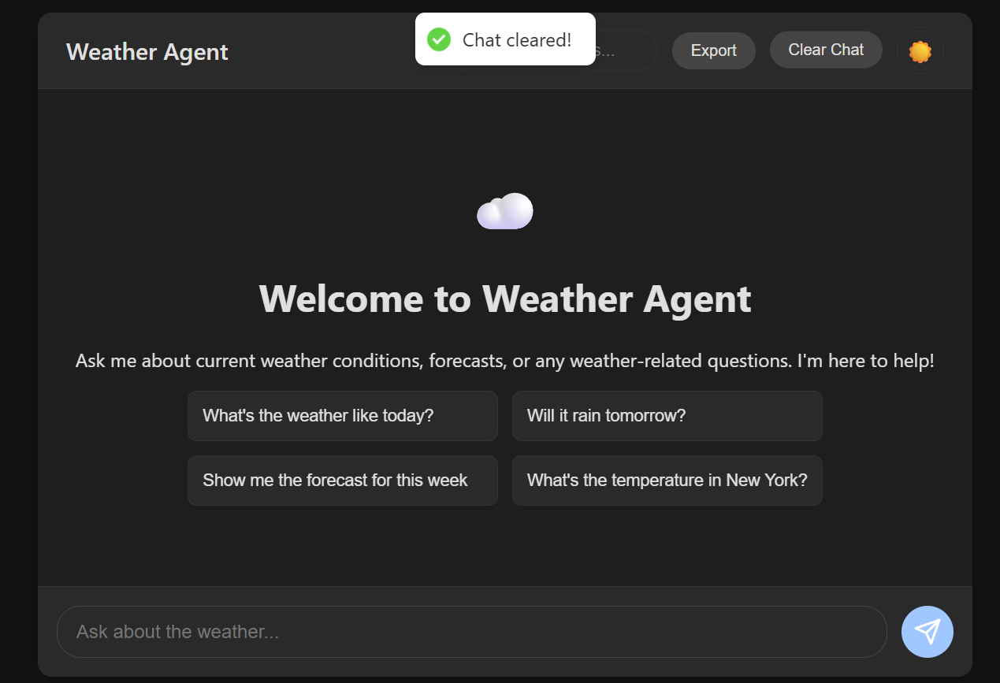
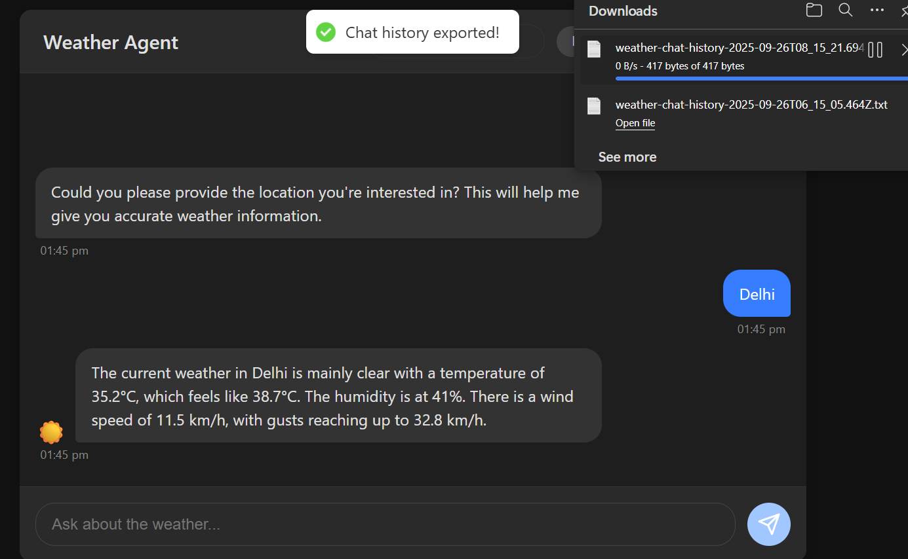

Weather Agent Chat Interface
This is a responsive, feature-rich chat application built with React that allows users to interact with a streaming weather agent API. The project fulfills all the core requirements of the assignment, including a polished UI, advanced bonus features like theme toggling and message search, and a robust, mobile-first design.

Live Demo
https://pazago-assignment.vercel.app/

Screenshots:

✅ Features
Core Functionality
Real-time Streaming: Handles streaming API responses to display the agent's message as it's being generated.

Chat History: Displays the full conversation history, which can be searched or cleared.

Loading & Error States: Provides clear user feedback with an animated typing indicator and non-intrusive toast notifications for errors.

UI/UX & Polish
Responsive, Mobile-First Design: The interface is optimized for mobile devices by default and adapts seamlessly to tablets and desktops.

Light & Dark Themes: Users can toggle between a light and dark mode, with their preference saved in local storage.

Polished Animations: Subtle animations on message bubbles and welcome screen elements create a dynamic and engaging user experience.

Welcome Screen: A user-friendly welcome page with prompt suggestions for first-time users.

Weather Icons: Agent responses are automatically parsed to display relevant weather emojis (☀️, ☁️, 🌧️) for at-a-glance information.

Bonus Features
Message Search: A search bar in the header allows users to filter the conversation and highlights matching text.

Export Chat History: Users can export the entire conversation to a .txt file with a single click.

Accessibility: Interactive elements include aria-label attributes to ensure compatibility with screen readers.

🔧 Technical Decisions
As per the assignment requirements, here is an explanation of the key technical choices made during development:

Framework (React + Vite): Vite was chosen as the build tool for its incredibly fast development server and simple setup, which allows for rapid iteration. React was used for its component-based architecture, which helped in creating a modular and maintainable codebase.

State Management (useState & useMemo): For this application, the state was primarily local to the main ChatWindow component. Therefore, React's built-in useState hook was sufficient and appropriate, avoiding the unnecessary complexity of a global state manager like Redux. The useMemo hook was used to efficiently filter messages for the search feature, ensuring this calculation only re-runs when necessary.

API Handling (useEffect & AbortController): Interacting with a streaming API in React, especially within StrictMode, presents challenges like duplicated requests. The final implementation uses:

A fetchTrigger state to explicitly control when the API call should run.

The useEffect hook to manage the lifecycle of the API call side-effect.

An AbortController to cancel the fetch request in the useEffect cleanup function. This is the key to creating a robust, StrictMode-compatible solution that prevents duplicate streams and memory leaks.

Styling (Mobile-First CSS with Variables): The application was styled using a mobile-first approach. The base styles target mobile devices, and min-width media queries are used to adapt the layout for larger screens. CSS variables were used extensively to implement the light and dark themes, allowing for an instant theme switch by changing a single data-theme attribute on the root element.

Error Handling (react-hot-toast): Instead of displaying errors as simple text on the page, the react-hot-toast library was integrated. This provides a much better user experience with non-intrusive, professional-looking pop-up notifications for both errors and success actions (like clearing or exporting the chat).

🛠️ Tech Stack
Framework: React

Build Tool: Vite

Styling: CSS3 (with CSS Variables)

Notifications: react-hot-toast

Deployment: Vercel

🚀 Setup and Installation
To run this project locally, follow these steps:

Clone the repository:

Bash

git clone https://github.com/rayanubhav/PAZAGO_Assignment

Install dependencies:

Bash

npm install

Run the development server:

Bash

npm run dev
The application will be available at http://localhost:5173.